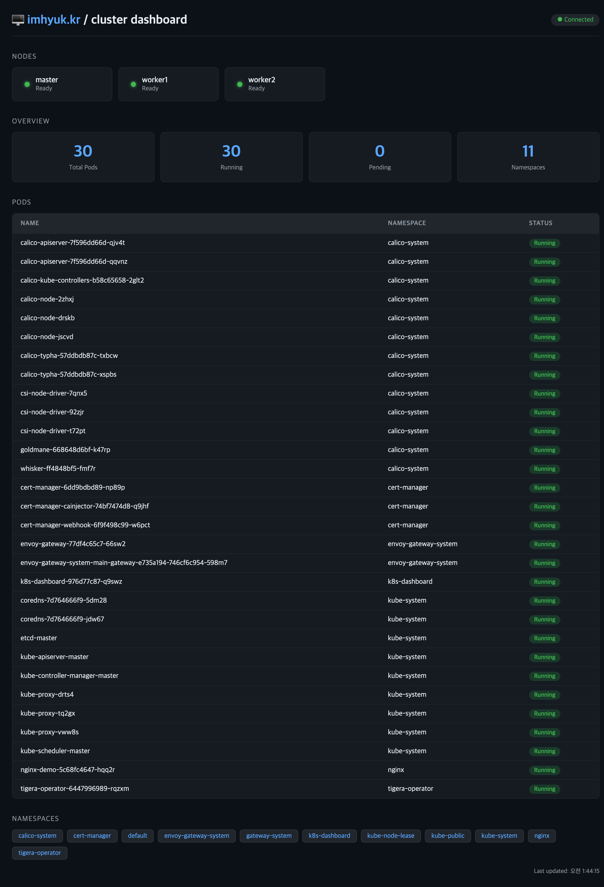

# 🖥️ K8s Dashboard

> **실시간 쿠버네티스 클러스터 모니터링 대시보드**  
> Spring Boot + WebSocket + Kubernetes Java Client

[](https://openjdk.org/)
[](https://spring.io/projects/spring-boot)
[](https://kubernetes.io/)
[](LICENSE)

---

## 📌 소개

`status.imhyuk.kr` 에서 운영 중인 실시간 쿠버네티스 클러스터 상태 대시보드입니다.  
OCI(Oracle Cloud Infrastructure) 위에 직접 구축한 베어메탈 쿠버네티스 클러스터의 노드, Pod, 네임스페이스 상태를 WebSocket을 통해 5초마다 실시간으로 시각화합니다.

---

## 📸 스크린샷



---

## 🏗️ 아키텍처

```
사용자 브라우저 (https://status.imhyuk.kr)
        │
        ▼
OCI Network Load Balancer (L4)
        │
        ▼
Envoy Gateway (TLS 종료 - *.imhyuk.kr 와일드카드 인증서)
        │  WSS → WS 변환
        ▼
k8s-dashboard Service (ClusterIP)
        │
        ▼
Spring Boot Pod (k8s-dashboard namespace)
  ├── Kubernetes Java Client  ──▶  kube-apiserver
  │     └── 노드 / Pod / 네임스페이스 조회
  └── WebSocket Handler
        └── 5초마다 클러스터 상태 브로드캐스트
```

### 인프라 구성

| 구성요소       | 기술 스택                                     |
|------------|-------------------------------------------|
| 클라우드       | Oracle Cloud Infrastructure (OCI)         |
| 쿠버네티스      | Self-managed Kubernetes (베어메탈)            |
| 인그레스       | Envoy Gateway + Gateway API               |
| TLS 인증서    | cert-manager + Let's Encrypt (DNS-01)     |
| 로드밸런서      | OCI Network Load Balancer (L4) → NodePort |
| 컨테이너 레지스트리 | OCI Container Registry (OCIR)             |

---

## ⚙️ 기술 스택

### 백엔드

- **Java 21**
- **Spring Boot 4.0.6**
- **Spring WebSocket**
- **Thymeleaf**
- **Kubernetes Java Client 26.0.0**
- **Lombok**

### 프론트엔드

- **HTML / CSS / Vanilla JS**
- **WebSocket API**

### 인프라

- **Kubernetes**
- **Envoy Gateway**
- **cert-manager**
- **OCI NLB**
- **Docker**

---

## 📂 프로젝트 구조

```
k8s-dashboard/
├── src/main/java/kr/imhyuk/k8sdashboard/
│   ├── controller/
│   │   └── DashboardController.java     # 페이지 라우팅 + REST API
│   ├── service/
│   │   └── K8sService.java              # Kubernetes Java Client 연동
│   └── websocket/
│       ├── WebSocketConfig.java         # WebSocket 설정
│       └── K8sWebSocketHandler.java     # 실시간 상태 브로드캐스트
├── src/main/resources/
│   └── templates/
│       └── dashboard.html               # 대시보드 UI
├── k8s/
│   ├── namespace.yaml
│   ├── serviceaccount.yaml              # ClusterRole + RBAC 설정
│   ├── deployment.yaml
│   ├── service.yaml
│   └── httproute.yaml                   # Gateway API HTTPRoute
├── Dockerfile
└── build.gradle.kts
```

---

## 🚀 배포 방법

### 사전 요구사항

- Kubernetes 클러스터
- Envoy Gateway 설치
- cert-manager 설치
- OCI Container Registry (또는 Docker Hub)
- Docker

### 1. 이미지 빌드 & 푸시

```bash
docker build -t ap-chuncheon-1.ocir.io/[tenancy]/k8s-dashboard:latest .
docker push ap-chuncheon-1.ocir.io/[tenancy]/k8s-dashboard:latest
```

### 2. OCI Registry 인증 Secret 생성

```bash
kubectl create secret docker-registry ocir-secret \
  --docker-server=ap-chuncheon-1.ocir.io \
  --docker-username=[tenancy-namespace]/[OCI username] \
  --docker-password='[Auth Token]' \
  --docker-email=[이메일] \
  -n k8s-dashboard
```

### 3. 쿠버네티스 리소스 배포

```bash
kubectl apply -f k8s/
```

### 4. 배포 확인

```bash
kubectl get pods -n k8s-dashboard
```

```
NAME                             READY   STATUS    RESTARTS   AGE
k8s-dashboard-xxxxxxxxx-xxxxx   1/1     Running   0          1m
```

---

## 📡 주요 기능

| 기능        | 설명                                            |
|-----------|-----------------------------------------------|
| 노드 상태     | Ready / NotReady / Unknown 실시간 표시             |
| Pod 목록    | 전체 네임스페이스 Pod 상태 (Running / Pending / Failed) |
| 네임스페이스    | 클러스터 내 전체 네임스페이스 목록                           |
| 실시간 업데이트  | WebSocket으로 5초마다 자동 갱신                        |
| HTTPS/WSS | Envoy Gateway TLS 종료로 보안 연결                   |

---

## 🔐 RBAC 권한

클러스터 정보 조회를 위해 최소한의 권한만 부여합니다.

```yaml
rules:
  - apiGroups: [ "" ]
    resources: [ "nodes", "pods", "namespaces" ]
    verbs: [ "get", "list", "watch" ]
```

---

## 📝 라이선스

MIT License © 2026 [IM HYUK](https://imhyuk.kr)